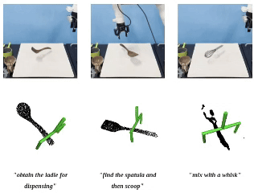

I am currently pursuing my M.S. at SUSTech's [RCVLab](https://rcvlab.eee.sustech.edu.cn/), under the guidance of Prof. [Hong Zhang](https://faculty.sustech.edu.cn/?tagid=zhangh33&iscss=1&snapid=1&orderby=date&go=2&lang=en). Prior to this, I earned my Bachelor's degree in Electronic Information Science and Technology from Dalian Maritime University.

My research interests involve **robotic manipulation and grasping**, **mobile manipulation**, **human-robot interaction**, and **semantic reasoning for robots**. The ultimate goal is to develop autonomous agents that can perceive, reason, and interact with the physical world with the same level of Intelligence as humans.

🎒Education
======
* M.S. Electronic Science and Technology, Southern University of Science and Technology(China), 2023 - Present
  * Department of Electrical and Electronic Engineering, School of Engineering 

* B.S. Electronic Information Science and Technology, Dalian Maritime University(China), 2019 - 2023
  * School of Information Science and Technology

📝Publication Brief View
======
<html>

<table style="width:100%;border:0px;border-spacing:0px;border-collapse:separate;margin-right:auto;margin-left:auto;">
  <tr onmouseout="nightsight_stop()" onmouseover="nightsight_start()">
    <td style="padding:10px;width:40%;vertical-align:middle;border-left-style:none;border-bottom-style:none;border-top-style:none;border-right-style:none">
      
    </td>
    <td style="padding:20px;width:75%;vertical-align:middle;border-left-style:none;border-bottom-style:none;border-top-style:none;border-right-style:none">
      <papertitle>FoundationGrasp: Generalizable Task-Oriented Grasping with Foundation Models</papertitle>
       
      Chao Tang, Dehao Huang, <strong>Wenlong Dong</strong>, Ruinian Xu, Hong Zhang
       
      <em>Published in 2025 IEEE Transactions on Automation Science and Engineering (RAL)</em> 
      <a href="https://arxiv.org/abs/2404.10399" target="_blank" class="custom-link arxiv">arxiv</a>
      <a href="https://sites.google.com/view/foundationgrasp"  target="_blank" class="custom-link web">site</a>
      <a href="https://youtu.be/B6iTa6BRB1w" target="_blank" class="custom-link video">video</a>
    </td>
  </tr>
</table>

</html>

🍻Selected Honors
======
* **Outstanding Graduate Award of Liaoning Province**, 2023
* **Top 10 College Student Nominee**, 2023
* **Holder of a National Invention Patent**
* **Approved for A National Undergraduate Innovation and Entrepreneurship Project**
* **National First Prize**, Robot Developer Competition **ROBOCOM** 2022
* **National First Prize，The Only Champion in Individual Event**, National College Embedded Chip and System Design Competition, 2022
* **National Second Prize**, National Software and Information Technology Professional Competition, 2021
* **National Third Prize**, China Collegiate Computing Competition, 2022
* **Provincial First Prize**, "National College Students Mathematical Contest in Modeling, Liaoning Provincial Division, 2021
* **Gold Award**, "Challenge Cup" China College Students’ Entrepreneurship Competition, Liaoning Provincial Division, 2022
