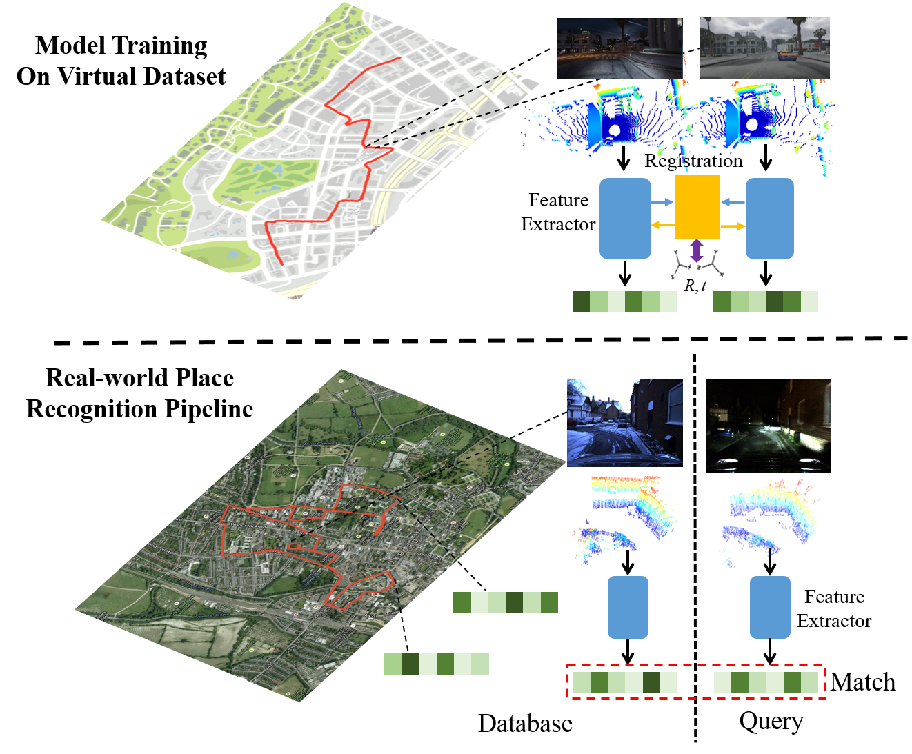
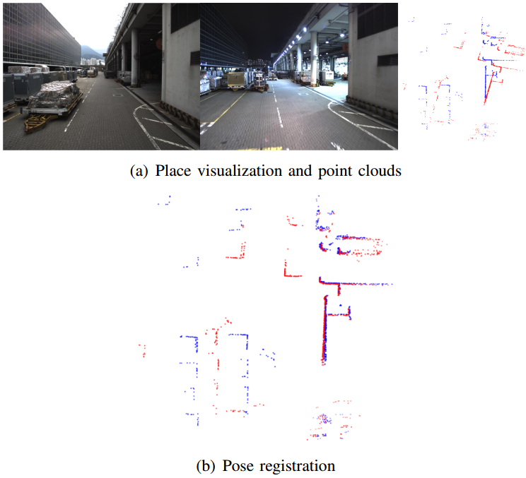
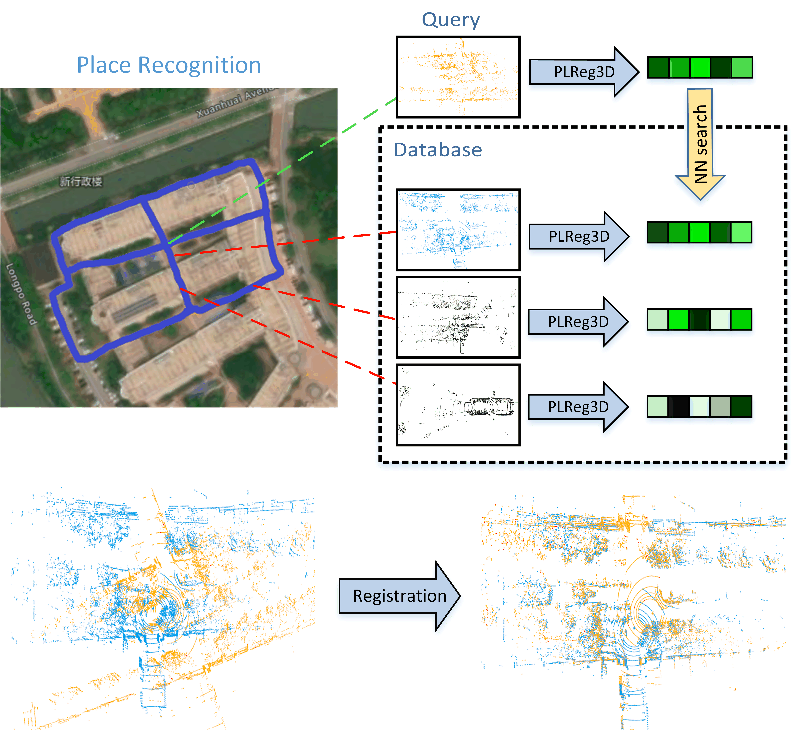
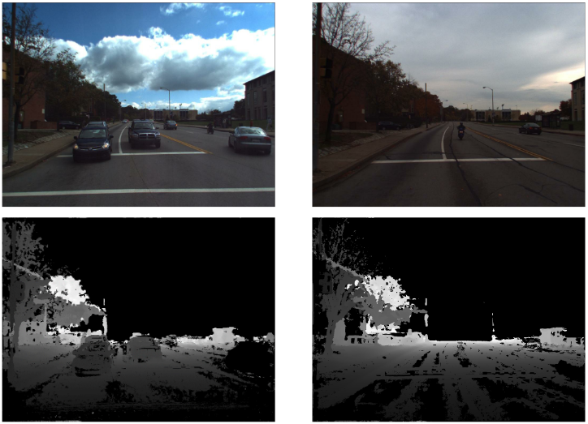
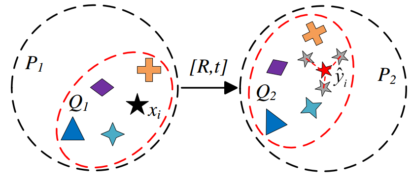
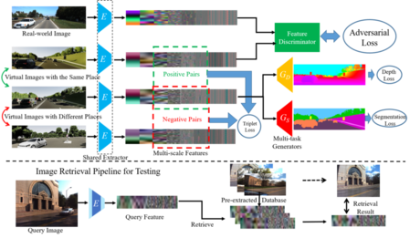
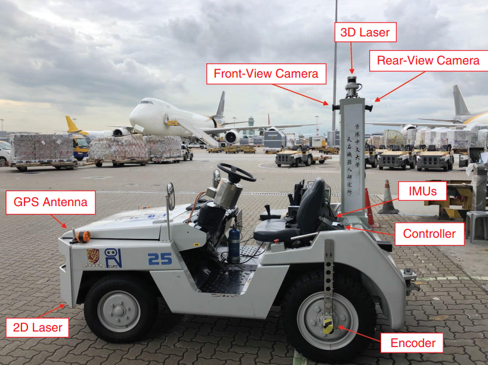
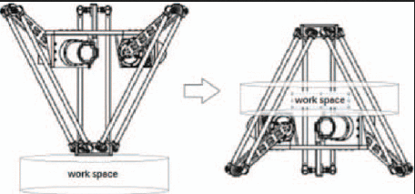

<html>
    <table style="width:100%;border:0px;border-spacing:0px;border-collapse:separate;margin-right:auto;margin-left:auto;">
          <tr onmouseout="nightsight_stop()" onmouseover="nightsight_start()">
            <td style="padding:20px;width:25%;vertical-align:middle;border-left-style:none;border-bottom-style:none;border-top-style:none;border-right-style:none">
              
            </td>
            <td style="padding:20px;width:75%;vertical-align:middle;border-left-style:none;border-bottom-style:none;border-top-style:none;border-right-style:none">
                <papertitle>Registration-aided 3D Point Cloud Learning for Large-Scale Place Recognition
                </papertitle>
               
              <strong>Zhijian Qiao</strong>, <a href="https://hanjianghu.github.io/">Hanjiang Hu</a>, Weiang Shi, Zhe Liu and <a href="https://scholar.google.com/citations?hl=en&user=q6AY9XsAAAAJ">Hesheng Wang</a>
               
              <em>IEEE/RSJ International Conference on Intelligent Robots and Systems (IROS), 2021.</em> 
              <a href="https://arxiv.org/abs/2012.05018">Paper</a>
              <a href="https://github.com/qiaozhijian/vLPD-Net.git">Code</a>
            </td>
          </tr>
    </table>
    <table style="width:100%;border:0px;border-spacing:0px;border-collapse:separate;margin-right:auto;margin-left:auto;">
          <tr onmouseout="nightsight_stop()" onmouseover="nightsight_start()">
            <td style="padding:20px;width:25%;vertical-align:middle;border-left-style:none;border-bottom-style:none;border-top-style:none;border-right-style:none">
              
            </td>
            <td style="padding:20px;width:75%;vertical-align:middle;border-left-style:none;border-bottom-style:none;border-top-style:none;border-right-style:none">
                <papertitle>Map-Less Long-Term Localization in Complex Industrial Environments
                </papertitle>
               
              Zhe Liu, <strong>Zhijian Qiao</strong>, Chuanzhe Suo, Yingtian Liu, and Kefan Jin
               
              <em>Assembly Automation, 2021.</em> 
            </td>
          </tr>
    </table>
    <table style="width:100%;border:0px;border-spacing:0px;border-collapse:separate;margin-right:auto;margin-left:auto;">
          <tr onmouseout="nightsight_stop()" onmouseover="nightsight_start()">
            <td style="padding:20px;width:25%;vertical-align:middle;border-left-style:none;border-bottom-style:none;border-top-style:none;border-right-style:none">
              
            </td>
            <td style="padding:20px;width:75%;vertical-align:middle;border-left-style:none;border-bottom-style:none;border-top-style:none;border-right-style:none">
                <papertitle>PLReg3D: Learning 3D Local and Global Descriptors Jointly for Global Localization
                </papertitle>
               
              <strong>Zhijian Qiao</strong>, Hanwen Wang, Yu Zhu and <a href="https://scholar.google.com/citations?hl=en&user=q6AY9XsAAAAJ">Hesheng Wang</a>
               
              <em>The IEEE 27th International Conference on Mechatronics and Machine Vision in Practice (M2VIP 2021).</em> 
              <a href="https://github.com/IRMVLab/PLReg3D.git">Code</a>
            </td>
          </tr>
    </table>
    <table style="width:100%;border:0px;border-spacing:0px;border-collapse:separate;margin-right:auto;margin-left:auto;">
          <tr onmouseout="nightsight_stop()" onmouseover="nightsight_start()">
            <td style="padding:20px;width:25%;vertical-align:middle;border-left-style:none;border-bottom-style:none;border-top-style:none;border-right-style:none">
              
            </td>
            <td style="padding:20px;width:75%;vertical-align:middle;border-left-style:none;border-bottom-style:none;border-top-style:none;border-right-style:none">
                <papertitle>SeasonDepth: Cross-Season Monocular Depth Prediction Dataset and Benchmark under Multiple Environments
                </papertitle>
               
              <a href="https://hanjianghu.github.io/">Hanjiang Hu</a>, Baoquan Yang, <strong>Zhijian Qiao</strong> and <a href="https://scholar.google.com/citations?hl=en&user=q6AY9XsAAAAJ">Hesheng Wang</a>
               
              <em> Submitted to NeurIPS 2021 Track for Datasets and Benchmarks, Jun. 2021</em> 
              <a href="https://arxiv.org/abs/2011.04408">Paper</a> /
              <a href="https://seasondepth.github.io/">project</a> /
              <a href="https://github.com/SeasonDepth/SeasonDepth">benchmark toolkit</a>
            </td>
          </tr>
    </table>
    <table style="width:100%;border:0px;border-spacing:0px;border-collapse:separate;margin-right:auto;margin-left:auto;">
          <tr onmouseout="nightsight_stop()" onmouseover="nightsight_start()">
            <td style="padding:20px;width:25%;vertical-align:middle;border-left-style:none;border-bottom-style:none;border-top-style:none;border-right-style:none">
              
            </td>
            <td style="padding:20px;width:75%;vertical-align:middle;border-left-style:none;border-bottom-style:none;border-top-style:none;border-right-style:none">
                <papertitle>Robust Simultaneous Tracking and Local Dense Structured Mapping at Scenes lack of Geometric Features
                </papertitle>
               
              Yueling Shen, <strong>Zhijian Qiao</strong>, Xu Wang and <a href="https://scholar.google.com/citations?hl=en&user=q6AY9XsAAAAJ">Hesheng Wang</a>
               
              <em>The IEEE 27th International Conference on Mechatronics and Machine Vision in Practice (M2VIP 2021).</em> 
            </td>
          </tr>
    </table>
    <table style="width:100%;border:0px;border-spacing:0px;border-collapse:separate;margin-right:auto;margin-left:auto;">
          <tr onmouseout="nightsight_stop()" onmouseover="nightsight_start()">
            <td style="padding:20px;width:25%;vertical-align:middle;border-left-style:none;border-bottom-style:none;border-top-style:none;border-right-style:none">
              
            </td>
            <td style="padding:20px;width:75%;vertical-align:middle;border-left-style:none;border-bottom-style:none;border-top-style:none;border-right-style:none">
                <papertitle>End-to-End  3D  Point  Cloud  Learning  for  Registration  Task  UsingVirtual  Correspondences
                </papertitle>
               
              <strong>Zhijian Qiao</strong>, Huanshu Wei, Zhe Liu, Chuanzhe Suo and <a href="https://scholar.google.com/citations?hl=en&user=q6AY9XsAAAAJ">Hesheng Wang</a>
               
              <em>IEEE/RSJ International Conference on Intelligent Robots and Systems (IROS), 2020</em> 
              <a href="https://arxiv.org/pdf/2011.14579.pdf">Paper</a> /
              <a href="https://github.com/qiaozhijian/VCR-Net.git">Code</a>
            </td>
          </tr>
    </table>
    <table style="width:100%;border:0px;border-spacing:0px;border-collapse:separate;margin-right:auto;margin-left:auto;">
          <tr onmouseout="nightsight_stop()" onmouseover="nightsight_start()">
            <td style="padding:20px;width:25%;vertical-align:middle;border-left-style:none;border-bottom-style:none;border-top-style:none;border-right-style:none">
              
            </td>
            <td style="padding:20px;width:75%;vertical-align:middle;border-left-style:none;border-bottom-style:none;border-top-style:none;border-right-style:none">
                <papertitle>DASGIL: Domain Adaptation for Semantic and Geometric-Aware Image-Based Localization
                </papertitle>
               
              <a href="https://hanjianghu.github.io/">Hanjiang Hu</a>, 
              <strong>Zhijian Qiao</strong>, Ming Cheng, Zhe Liu and <a href="https://scholar.google.com/citations?hl=en&user=q6AY9XsAAAAJ">Hesheng Wang</a>
               
              <em> IEEE Transactions on Image Processing (2019IF:9.34), Dec. 2020</em> 
              <a href="https://ieeexplore.ieee.org/document/9296559">Paper</a> /
              <a href="https://github.com/HanjiangHu/DASGIL">Code</a>
            </td>
          </tr>
    </table>
    <table style="width:100%;border:0px;border-spacing:0px;border-collapse:separate;margin-right:auto;margin-left:auto;">
          <tr onmouseout="nightsight_stop()" onmouseover="nightsight_start()">
            <td style="padding:20px;width:25%;vertical-align:middle;border-left-style:none;border-bottom-style:none;border-top-style:none;border-right-style:none">
              
            </td>
            <td style="padding:20px;width:75%;vertical-align:middle;border-left-style:none;border-bottom-style:none;border-top-style:none;border-right-style:none">
                <papertitle>Deep Learning-Based Localization and Perception Systems: Approaches for Autonomous Cargo Transportation Vehicles in Large-Scale, Semiclosed Environments
                </papertitle>
               
              Zhe Liu, Chuanzhe Suo, Yingtian Liu, Yueling Shen, <strong>Zhijian Qiao</strong>, Huanshu Wei, Shunbo Zhou, Haoang Li, Xinwu Liang, 
              <a href="https://scholar.google.com/citations?hl=en&user=q6AY9XsAAAAJ">Hesheng Wang</a>, Yun-Hui Liu
               
              <em> IEEE Robotics & Automation Magazine, vol. 27, no. 2, pp. 139-150, June 2020</em> 
              <a href="ieeexplore.ieee.org/document/9062309">Paper</a>
            </td>
          </tr>
    </table>
    <table style="width:100%;border:0px;border-spacing:0px;border-collapse:separate;margin-right:auto;margin-left:auto;">
          <tr onmouseout="nightsight_stop()" onmouseover="nightsight_start()">
            <td style="padding:20px;width:25%;vertical-align:middle;border-left-style:none;border-bottom-style:none;border-top-style:none;border-right-style:none">
              
            </td>
            <td style="padding:20px;width:75%;vertical-align:middle;border-left-style:none;border-bottom-style:none;border-top-style:none;border-right-style:none">
                <papertitle>Innovative design and realization of lightweight delta robot platform
                </papertitle>
               
              Cong Dehong, Li Chengyao, Wang Ruchao, Song Chen, Tian Chang and <strong>Zhijian Qiao</strong>
               
              <em>Chinese Control And Decision Conference (CCDC), 2017</em> 
              <a href="https://ieeexplore.ieee.org/document/7978260">Paper</a>
            </td>
          </tr>
    </table>
    
</html>