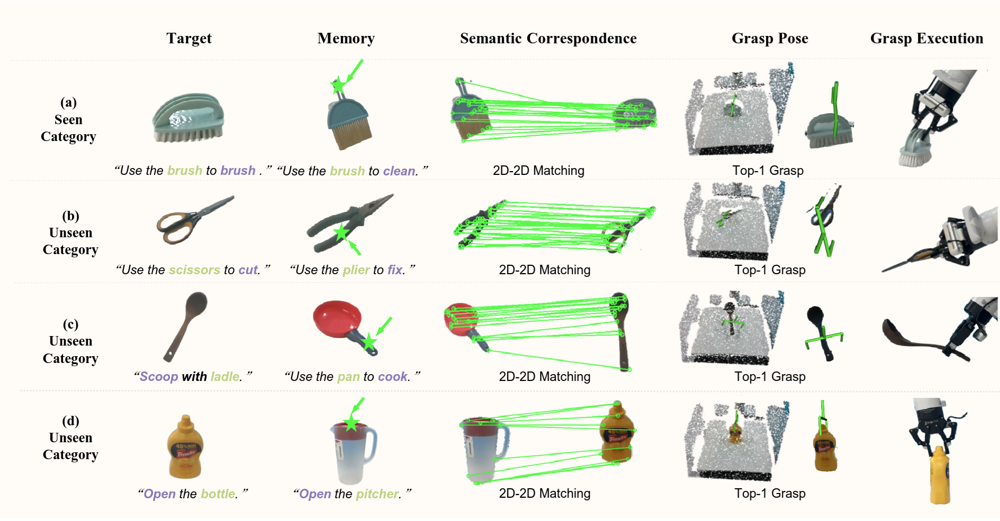
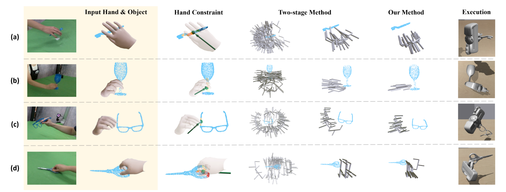
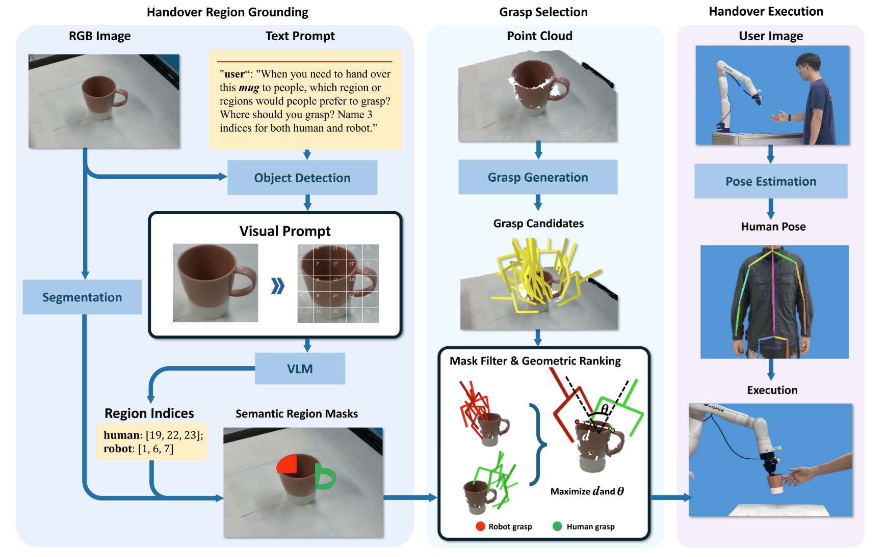
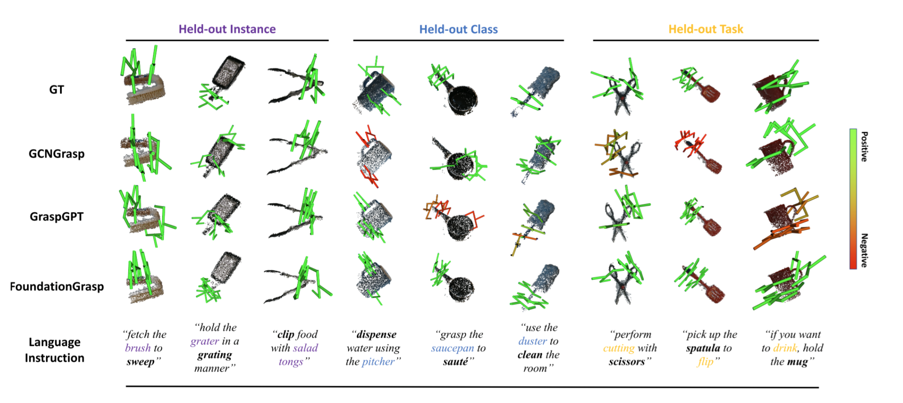
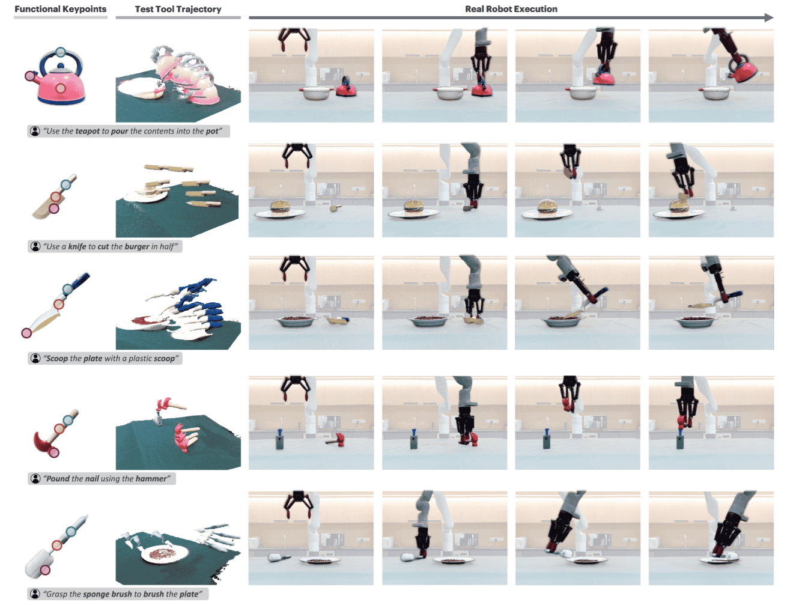



<html>

<h1 id="work1" class="page1" >RTAGrasp: Learning Task-Oriented Grasping from Human Videos via Retrieval, Transfer, and Alignment</h1>
<a href="https://arxiv.org/pdf/2409.16033" target="_blank" class="custom-link arxiv">ICRA2025: Pdf</a>
<a href="https://sites.google.com/view/rtagrasp/home"  target="_blank" class="custom-link web">site</a>
<a href="https://youtu.be/kjbltBw84Rg" target="_blank" class="custom-link video">video</a>

Abstract: Task-oriented grasping (TOG) is crucial for robots to accomplish manipulation tasks, requiring the determination of TOG positions and directions. Existing methods either rely on costly manual TOG annotations or only extract coarse grasping positions or regions from human demonstrations, limiting their practicality in real-world applications. To address these limitations, we introduce RTAGrasp, a Retrieval, Transfer, and Alignment framework inspired by human grasping strategies. Specifically, our approach first effortlessly constructs a robot memory from human grasping demonstration videos, extracting both TOG position and direction constraints. Then, given a task instruction and a visual observation of the target object, RTAGrasp retrieves the most similar human grasping experience from its memory and leverages semantic matching capabilities of vision foundation models to transfer the TOG constraints to the target object in a training-free manner. Finally, RTAGrasp aligns the transferred TOG constraints with the robot’s action for execution. Evaluations on the public TOG benchmark, TaskGrasp dataset, show the competitive performance of RTAGrasp on both seen and unseen object categories compared to existing baseline methods. Real-world experiments further validate its effectiveness on a robotic arm. 

  

<h1 id="work2" class="page1" >HGDiffuser: Efficient Task-Oriented Grasp Generation via Human-Guided Grasp</h1>
<a href="https://arxiv.org/pdf/2503.00508" target="_blank" class="custom-link arxiv">Submitted to IROS2025: Pdf</a>
<a href="https://sites.google.com/view/hgdiffuser"  target="_blank" class="custom-link web">site</a>
<a href="https://youtu.be/fUt6cE9SZoY" target="_blank" class="custom-link video">video</a>

Abstract: Task-oriented grasping (TOG) is essential for robots to perform manipulation tasks, requiring grasps that are both stable and compliant with task-specific constraints. Humans naturally grasp objects in a task-oriented manner to facilitate subsequent manipulation tasks. By leveraging human grasp demonstrations, current methods can generate high-quality robotic parallel-jaw task-oriented grasps for diverse objects and tasks. However, they still encounter challenges in maintaining grasp stability and sampling efficiency. These methods typically rely on a two-stage process: first performing exhaustive task-agnostic grasp sampling in the 6-DoF space, then applying demonstration-induced constraints (e.g., contact regions and wrist orientations) to filter candidates. This leads to inefficiency and potential failure due to the vast sampling space. To address this, we propose the Human-guided Grasp Diffuser (HGDiffuser), a diffusion-based framework that integrates these constraints into a guided sampling process. Through this approach, HGDiffuser directly generates 6-DoF task-oriented grasps in a single stage, eliminating exhaustive task-agnostic sampling. Furthermore, by incorporating Diffusion Transformer (DiT) blocks as the feature backbone, HGDiffuser improves grasp generation quality compared to MLP-based methods. Experimental results demonstrate that our approach significantly improves the efficiency of task-oriented grasp generation, enabling more effective transfer of human grasping strategies to robotic systems.

  

<h1 id="work3" class="page1" >Leveraging Semantic and Geometric Information for Zero-Shot Robot-to-Human Handover</h1>
<a href="https://arxiv.org/pdf/2409.17621" target="_blank" class="custom-link arxiv">ICRA2025: Pdf</a>
<a href="https://sites.google.com/view/vlm-handover/"  target="_blank" class="custom-link web">site</a>
<a href="https://youtu.be/_Q36TWdC59Q" target="_blank" class="custom-link video">video</a>

Abstract: Task-oriented grasping (TOG) is essential for robots to perform manipulation tasks, requiring grasps that are both stable and compliant with task-specific constraints. Humans naturally grasp objects in a task-oriented manner to facilitate subsequent manipulation tasks. By leveraging human grasp demonstrations, current methods can generate high-quality robotic parallel-jaw task-oriented grasps for diverse objects and tasks. However, they still encounter challenges in maintaining grasp stability and sampling efficiency. These methods typically rely on a two-stage process: first performing exhaustive task-agnostic grasp sampling in the 6-DoF space, then applying demonstration-induced constraints (e.g., contact regions and wrist orientations) to filter candidates. This leads to inefficiency and potential failure due to the vast sampling space. To address this, we propose the Human-guided Grasp Diffuser (HGDiffuser), a diffusion-based framework that integrates these constraints into a guided sampling process. Through this approach, HGDiffuser directly generates 6-DoF task-oriented grasps in a single stage, eliminating exhaustive task-agnostic sampling. Furthermore, by incorporating Diffusion Transformer (DiT) blocks as the feature backbone, HGDiffuser improves grasp generation quality compared to MLP-based methods. Experimental results demonstrate that our approach significantly improves the efficiency of task-oriented grasp generation, enabling more effective transfer of human grasping strategies to robotic systems.

  

<h1 id="work4" class="page1" >Task Oriented Grasp (TOG) Generation Generalized by Foundation Model</h1>
<a href="https://arxiv.org/abs/2404.10399" target="_blank" class="custom-link arxiv">T-ASE2025: Pdf</a>
<a href="https://sites.google.com/view/foundationgrasp"  target="_blank" class="custom-link web">site</a>
<a href="https://youtu.be/B6iTa6BRB1w" target="_blank" class="custom-link video">video</a>

Abstract: Task-oriented grasping (TOG), which refers to synthesizing grasps on an object that are configurationally compatible with the downstream manipulation task, is the first milestone towards tool manipulation. Analogous to the activation of two brain regions responsible for semantic and geometric reasoning during cognitive processes, modeling the intricate relationship between objects, tasks, and grasps necessitates rich semantic and geometric prior knowledge about these elements. Existing methods typically restrict the prior knowledge to a closed-set scope, limiting their generalization to novel objects and tasks out of the training set. To address such a limitation, we propose FoundationGrasp, a foundation model-based TOG framework that leverages the open-ended knowledge from foundation models to learn generalizable TOG skills. Extensive experiments are conducted on the contributed Language and Vision Augmented TaskGrasp (LaViA-TaskGrasp) dataset, demonstrating the superiority of FoundationGrasp over existing methods when generalizing to novel object instances, object classes, and tasks out of the training set. Furthermore, the effectiveness of FoundationGrasp is validated in real-robot grasping and manipulation experiments on a 7-DoF robotic arm.

  

<h1 id="work5" class="page1" >FUNCTO: Function-Centric One-Shot Imitation Learning for Tool Manipulation</h1>
<a href="https://arxiv.org/pdf/2502.11744" target="_blank" class="custom-link arxiv">Submitted to IROS2025: Pdf</a>
<a href="https://sites.google.com/view/functo"  target="_blank" class="custom-link web">site</a>
<a href="https://youtu.be/E_NXAZKRvWk" target="_blank" class="custom-link video">video</a>

Abstract: Learning tool use from a single human demonstration video offers a highly intuitive and efficient approach to robot teaching. While humans can effortlessly generalize a demonstrated tool manipulation skill to diverse tools that support the same function (e.g., pouring with a mug versus a teapot), current one-shot imitation learning (OSIL) methods struggle to achieve this. A key challenge lies in establishing functional correspondences between demonstration and test tools, considering significant geometric variations among tools with the same function (i.e., intra-function variations). To address this challenge, we propose FUNCTO (Function-Centric OSIL for Tool Manipulation), an OSIL method that establishes function-centric correspondences with a 3D functional keypoint representation, enabling robots to generalize tool manipulation skills from a single human demonstration video to novel tools with the same function despite significant intra-function variations. With this formulation, we factorize FUNCTO into three stages: (1) functional keypoint extraction, (2) function-centric correspondence establishment, and (3) functional keypoint-based action planning. We evaluate FUNCTO against exiting modular OSIL methods and end-to-end behavioral cloning methods through real-robot experiments on diverse tool manipulation tasks. The results demonstrate the superiority of FUNCTO when generalizing to novel tools with intra-function geometric variations.

  

</html>